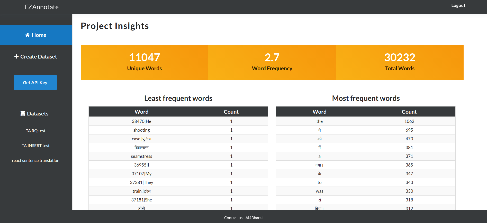
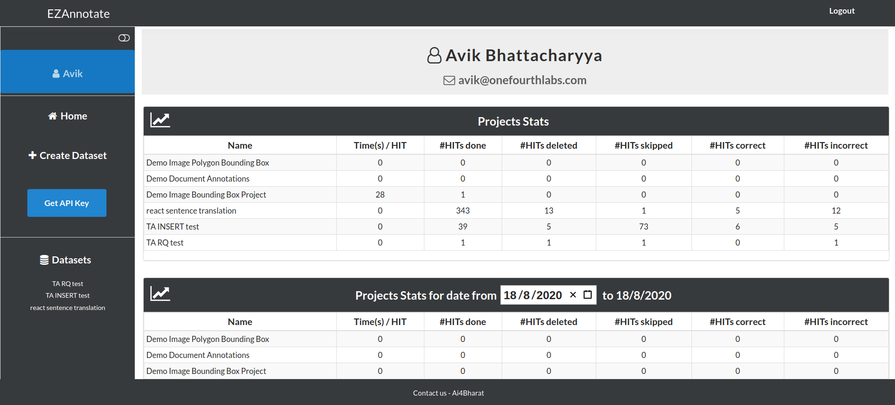
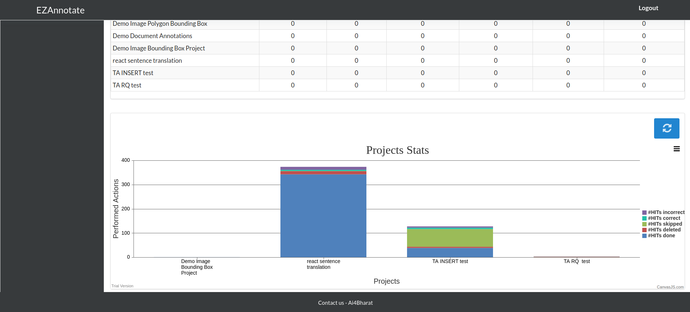

# Data Visualisation

EZAnnotate provides multiple different types of data visualisation and analytics based on project and user.

## Project Insight

This is project-based data analytics. You can see the metrics like **Unique Words**, **Word Frequency** etc in a text-annotation type project. The insight dashboard also shows you ordered chart tables like **Least frequent words**, **Most frequent words** etc based on the occurrence per word.

## User Statistics

EZAnnotate has a built-in stat-metric in the profile section. It shows project-specific analytics based on the authenticated user.

When a person has worked on many projects, managing that can be complicated. The user-stat provided by EZAnnotate lets you put a grip on that. The analytic shows various statistics like Time(s) per HIT, Performed HITs, Deleted or Skipped HITs, Correct or Incorrect HITs etc. These statistics are shown based on the projects that the user has worked so far. 

This metric also supports stat-search functionality out of the box. This feature will enable you to search and visualise the performance matrics by a given date or a given date range. The resulting statistics are also shown based on projects. This also has a built-in bar chart integrated which can be used coupled with the stat-search functionality.

