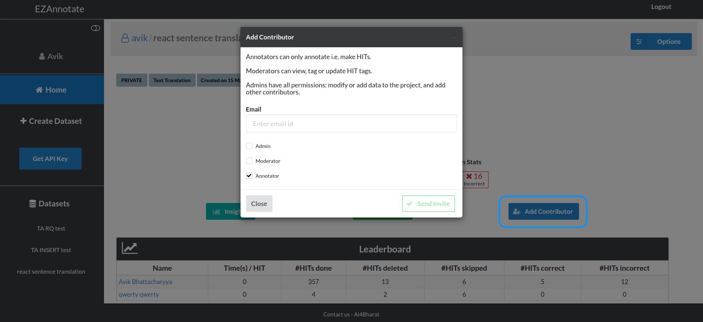
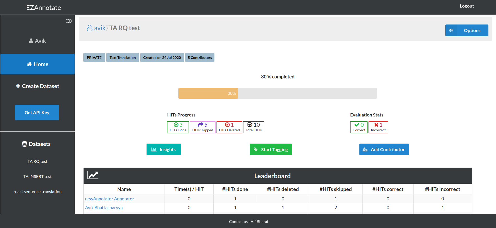
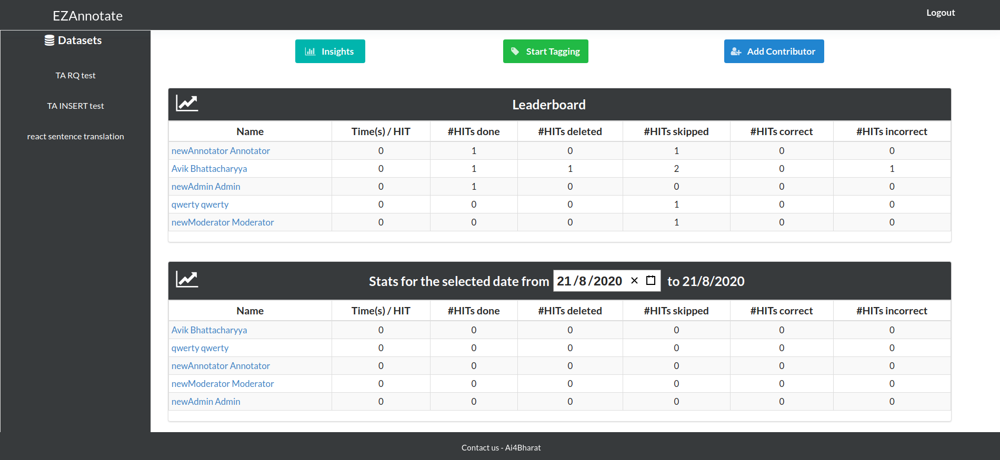

# Multi-user work support to facilitate Teams

EZAnnotate lets you work on a project as an individual or a team. After creating a project, simply press the **add contributor**, write the target user email and send out the invite. Upon receiving the user will accept and will be added to the team.

You can add three types of users in your team:

- **Admin:** Have access to all functionalities of a project.
- **Moderator:** Have access to all major functionalities of a project except adding new contributors and updating core project related details.
- **Annotator:** Have access to all task-level functionality of a project.

Now managing multiple users can be tricky. EZAnnotate has support for a sophisticated dashboard which shows various statistics like **Time(s) per HIT**,	**Performed HITs**, **Deleted or Skipped HITs**, **Correct or Incorrect HITs** etc. These statistics are shown based on users so that the admin or moderator for a project can keep track or evaluate the performance of an individual.

EZAnnotate also supports stat-search functionality out of the box. This feature will enable you to search and visualise the performance matrics by a given date or a given date range. The resulting statistics are also shown based on users.

