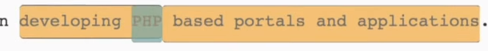
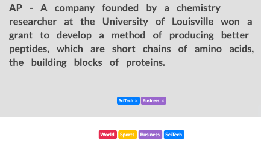
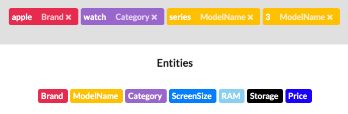
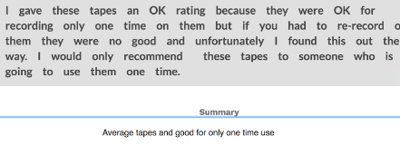
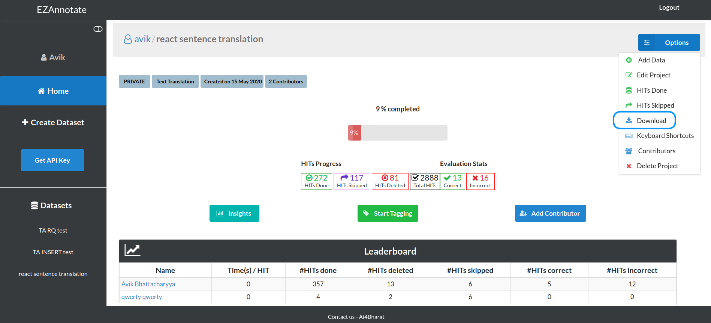

# Full-Length Document Annotations

Using this feature, you can tag and mark entities in *PDF, DOC, DOCX or text documents*. You can just create such a project, upload your data and start tagging. You can collect the data once you are done by downloading. 

## Features

- **Multi-labelling and Overlapping:** This feature enables you to tag entities inside other entity.

- **Text Classification:** This features enables you to perform classification on your textual data. You can classify them in single or multi classes from the available set of classes.

- **NER and PoS Labeling:** This useful feature enables you to tag **entities** from the available set of tag-able entities. You can tag **parts-of-speech** using this feature as well.

- **Text Summarization:** If you have some text or a bulk content, by this feature you can easily and effectively moderate all your content.

## How it Works

- **On the tagger window, you can see all the available tags. They are color-coded.**

- **You can select any word on sentence and then select the checkboxes from the tagging window. Once done, press the save to tag the selected data. You can label data with multiple tags.**

- **You can also perform multi-labelling on single data. After labelling it once, select the data and label it again in the same process described above.**

### Uploading data

If you have your untagged data ready with you at the moment of project creation, you can directly upload them on creation. If not, you can add them or any additional data to the project anytime at your will.

There are two ways you can upload the data:

- **Single Upload:** A single text file e.g. PDF or TXT or DOC etc can be uploaded. In this case, the whole document that has been uploaded will become an item to be tagged.

- **Bulk Upload:** If you have more than one document, you can simply combine them in a zip file and upload it. The uploaded zip will be auto-extracted in the process and the system will receive all the documents. In this case, each of this document that was bound under the zip will become independent data items that can be tagged.

### Downloading tagged data

Once you are done with the tagging, you can download the result. 

The resulting data is a *text file*. Each line of the result data is a **JSON** which contains the text from the document. Also, the **JSON** contains the definition of each entity that has been tagged or labelled in the document. You can also download the content in the Stanford NLP or spacy format.

