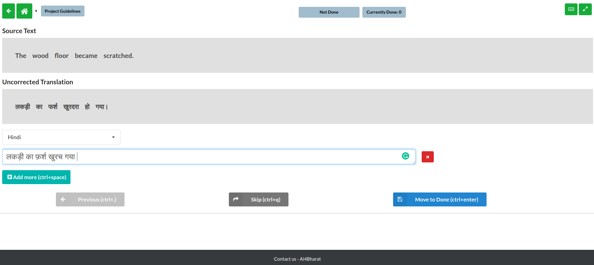

# Text Annotation

Using this feature, you can provide correct annotations or translation for any given text. Why is this feature useful? In some cases, we require a large amount of text which includes translation data to perform some desired cross-language tasks. Now, most of the cases people crawl these data and it is obvious that the data will have errors to some extent based on various factors like source material or crawl algorithm etc.

The **text annotation** is a simple feature provided by EZAnnotate that lets you correct/resolve those errors.

## Augmented Transliteration Input Tool

Recently we have walked an extra mile and integrated a **Transliteration Input Tool**(we call it the TIA). Optimised especially for you. By this, you can easily provide correct texts in a wide array of Indian languages.

## Supported Language for the TIA

Currently, we support the following languages:

| Supported Languages |
| ------------------- |
| Telugu              |
| Sanskrit            |
| Malayalam Inscript  |
| Punjabi             |
| Hindi               |
| Assamese            |
| Nepali              |
| Bengali             |
| Kannada             |
| Gujrati             |
| Marathi             |
| Odia                |
| Tamil               |

### Please refer the following video to understand the way the translation works

